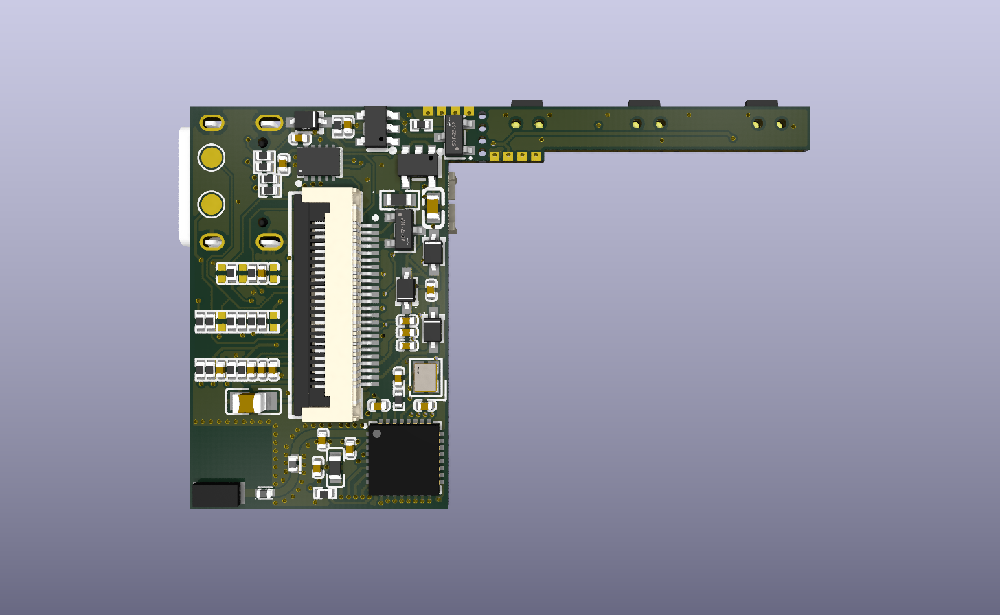
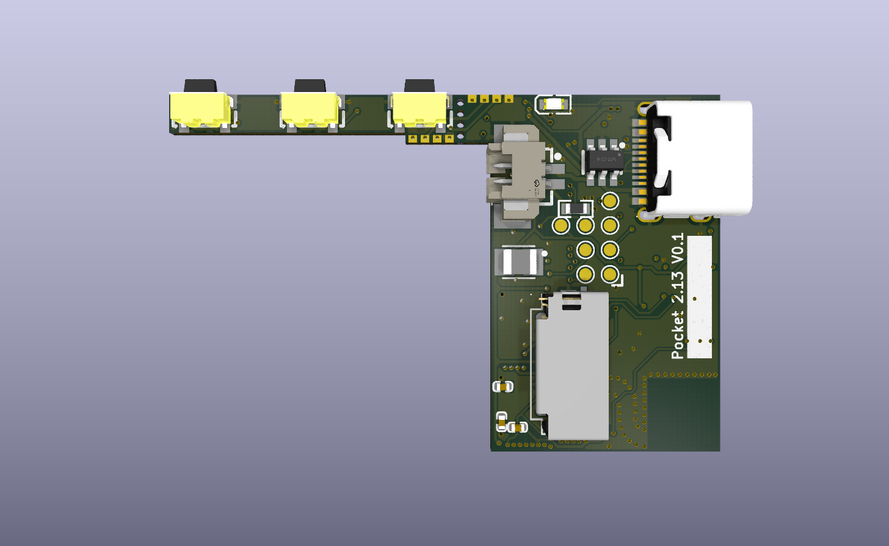

# Pocket 2.66 — E-reader PCB

A compact e-reader PCB built around a 2.13"/2.66" e-ink display and the ESP32-C3FH4 microcontroller.

<p align="center">
  
  
</p>

## Features

- **MCU:** ESP32-C3FH4 (RISC-V, 2.4 GHz Wi-Fi + BLE, 4 MB flash)
- **Display:** 2.13"/2.66" e-ink, connected via 24-pin FPC
- **Power:** USB-C input, single-cell Li-Po with GX4054 charger and BQ27220 fuel gauge
- **Storage:** micro-SD card slot
- **Connectivity:** On-board SMD 2.4 GHz antenna (Not yet matched to 35 Ohm)
- **Form factor:** 4-layer 1 mm PCB, min trace 0.12 mm, min via 0.3/0.4 mm (designed for JLCPCB)

## Repository contents

```
├── Pocket 2.66.kicad_sch       Schematic
├── Pocket 2.66.kicad_pcb       PCB layout
├── Pocket 2.66.kicad_pro       KiCad project file
├── Pocket 2.66.kicad_dru       Design rules
├── libs/lcsc/.                 Component Library
├── documentation/
│   ├── Pocket 2.66 BOM with MPN.csv   Schematic BOM
│   ├── Pocket 2.66 Interactive.html   Interactive PCB BOM
│   ├── PCB.stl
│   └── V0_schematic_review.pdf
└── production/
    ├── Pocket_2.66.zip         Gerber + drill files for fabrication
    ├── bom.csv                 JLCPCB BOM (for PCBA)
    ├── positions.csv           JLCPCB pick-and-place (for PCBA)
    └── netlist.ipc
```

## Additional parts
To make an E-reader, you need this PCB fully assembled, and:
- **Display** 24-pin 2.13"/2.66" Black/White E-ink display (e.g. Waveshare)
- **Battery** 803450 1500 mAh battery for 2.66" version or 802540 800 mAh battery for 2.13" version. Use 1.25 mm 2P Picoblade connector
- **Housing** 3D printing files coming soon


## Key components

| Ref | Part | Description |
|-----|------|-------------|
| U1 | ESP32-C3FH4 | Main MCU |
| U2 | LCK-TF-027H30008-WLG | Push-pull micro-SD slot |
| U3 | GX4054 | Li-Po charger |
| U4 | GS2019-33TR5 | 3.3 V LDO |
| U5 | BQ27220YZFR | Battery fuel gauge |
| U6 | SRV05-4-P-T7 | USB ESD protection |
| P1 | USB-TYPE-C-018 | USB-C connector |
| P3 | FPC-05F-24PH20 | 24-pin FPC for e-ink display |
| ANT2 | H2U38D1E1B0100 | 2.4 GHz SMD antenna |
| X1 | XL7EL89CLI-111YLC-40M | 40 MHz crystal |

## Opening the project

1. Open **KiCad 8** or later.
2. File → Open Project → select `Pocket 2.66.kicad_pro`.
3. The component library is self-contained in `libs/lcsc/`. The project's `fp-lib-table` and `sym-lib-table` already point to it, so no additional setup is needed.
4. Set the `KICAD_LCSC_3D_MODEL_DIR` path variable to `${KIPRJMOD}/libs/lcsc/3dmodels` for 3D models to appear (Preferences → Configure Paths).

## Production files

Ready-to-order Gerber files are in `production/Pocket_2.66.zip`. The BOM and pick-and-place files are formatted for JLCPCB PCBA.
